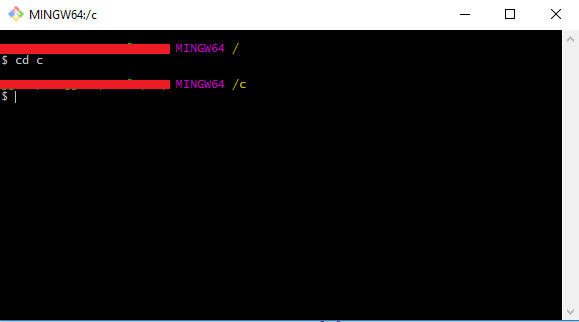

Custom Event Provider
=====================

This repository contains an example manifest for creating a custom event provider for with windows event log. This provider was inspired by the Stack Overflow [How to store an object in the Windows Event Log?](http://stackoverflow.com/questions/43587652/how-to-store-an-object-in-the-windows-event-log)

Most of the content for this manifest came for an article by [Daniel Gordon](http://blog.dlgordon.com/2012/06/writing-to-event-log-in-net-right-way.html) In facts, the steps come directly from his article. I made modifications to his manifest file to represent the details of the Stack Overflow.

How to Install
==============

1.	Open a git bash prompt and go to c:        
2.	Clone the repository and cd to cloned directory location.        
3.	Open a Visual Studio Command Prompt and cd to C:\CustomProvider        
4.	Compile the manifest: `mc -css Namespace CustomProvider.man`        
5.	Create the resource file: `rc CustomProvider.rc`        
6.	Compile the source: `csc /target:library /unsafe /win32res:CustomProvider.res CustomProvider.cs`      
7.	Register the provider. `wevtutil im CustomProvider.man`       
8.	You'll now see the custom provider in the Windows Event Viewer        
9.	To write to the log, open a Windows Powershell prompt and execute `New-WinEvent -ProviderName CustomProvider -Id 10000 -Payload @("MyValue1")` then refresh the event log and you'll see the event.        
10.	Congratulations, you've created a custom provider thanks to this repository and Daniel Gordon
